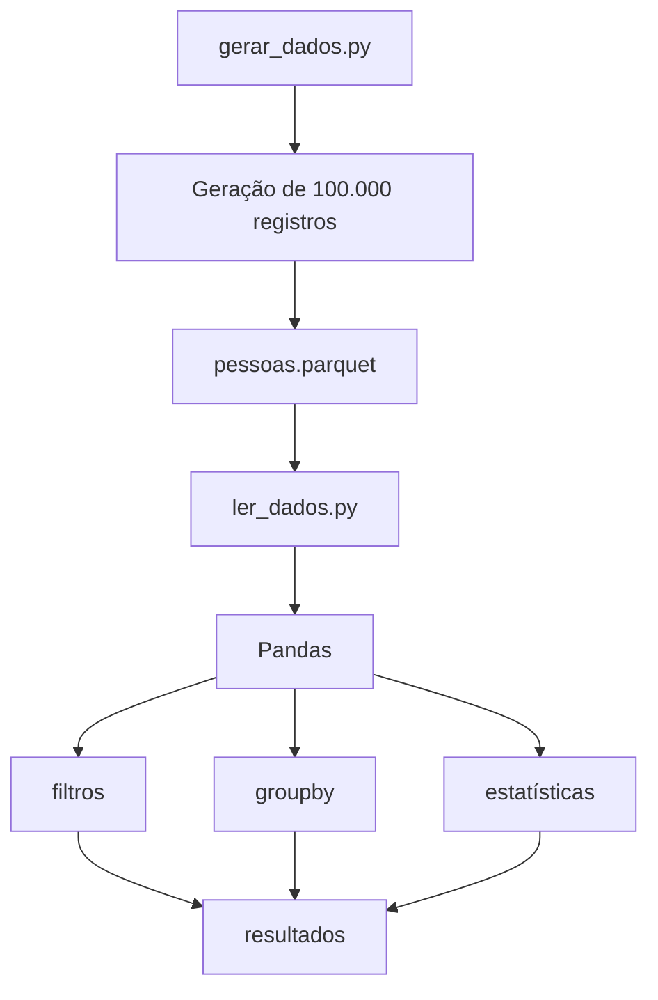

# **Python + Pandas + Parquet**

Um projeto didático utilizando **Python + Pandas + Parquet**: 

1. Gerar uma massa de dados, salvar em Parquet e 
2. Ler o arquivo fazendo filtros e algumas análises.

## 1\. Instalação

 Você pode instalar as bibliotecas com:

```bash
pip install pandas pyarrow
```

 O `pyarrow` será usado pelo Pandas para escrever e ler o arquivo Parquet.

 ## 2\. Código para gerar a massa de dados

 Este exemplo cria **100.000 registros** de pessoas com `id`, `nome`, `idade`, `cidade`, `estado`, `salario` e `data_cadastro`, e salva tudo em um arquivo Parquet.

```python
import pandas as pd
import random
from datetime import datetime, timedelta

# Quantidade de registros
QUANTIDADE_REGISTROS = 100_000

# Dados utilizados para gerar a massa
nomes = [
    "Ana", "João", "Maria", "Pedro", "Carlos",
    "Juliana", "Marcos", "Fernanda", "Lucas", "Beatriz"
]

cidades_estados = [
    ("Rio de Janeiro", "RJ"),
    ("São Paulo", "SP"),
    ("Belo Horizonte", "MG"),
    ("Curitiba", "PR"),
    ("Porto Alegre", "RS"),
    ("Salvador", "BA"),
    ("Recife", "PE"),
    ("Brasília", "DF")
]

# Gerador de dados
dados = []

data_inicial = datetime(2020, 1, 1)

for i in range(1, QUANTIDADE_REGISTROS + 1):

    cidade, estado = random.choice(cidades_estados)

    dados.append({
        "id": i,
        "nome": random.choice(nomes),
        "idade": random.randint(18, 70),
        "cidade": cidade,
        "estado": estado,
        "salario": round(random.uniform(1500, 15000), 2),
        "data_cadastro": data_inicial + timedelta(
            days=random.randint(0, 2000)
        )
    })

# Cria o DataFrame
df = pd.DataFrame(dados)

# Salva em Parquet
df.to_parquet(
    "pessoas.parquet",
    engine="pyarrow",
    index=False
)

print("Arquivo Parquet criado com sucesso!")
print(f"Quantidade de registros: {len(df)}")
print(df.head())
```

 Depois da execução, teremos:

```text
projeto/
├── gerar_dados.py
└── pessoas.parquet
```

 O arquivo `pessoas.parquet` contém os 100 mil registros.

---

 # 3\. Código para ler o Parquet e fazer filtros

 Agora podemos criar outro arquivo, por exemplo `ler_dados.py`.

```python
import pandas as pd

# Lê o arquivo Parquet
df = pd.read_parquet(
    "pessoas.parquet",
    engine="pyarrow"
)

print("Quantidade de registros:")
print(len(df))

print("\nPrimeiros registros:")
print(df.head())
```

 Como o Parquet é colunar, também podemos solicitar somente as colunas que precisamos:

```python
df = pd.read_parquet(
    "pessoas.parquet",
    columns=["nome", "idade", "cidade", "salario"]
)

print(df.head())
```

 Isso é interessante porque não precisamos necessariamente carregar todas as colunas do arquivo.

---

 # 4\. Fazendo filtros com Pandas

 Agora podemos explorar os dados.

 ### Pessoas com idade maior que 50

```python
filtro = df[df["idade"] > 50]

print(filtro)
```

 ### Pessoas com salário maior que R$ 10.000

```python
filtro = df[df["salario"] > 10000]

print(filtro)
```

 ### Pessoas que moram no Rio de Janeiro

```python
filtro = df[df["cidade"] == "Rio de Janeiro"]

print(filtro)
```

 ### Pessoas de São Paulo com salário acima de R$ 8.000

 Podemos combinar condições utilizando `&`:

```python
filtro = df[
    (df["estado"] == "SP") &
    (df["salario"] > 8000)
]

print(filtro)
```

 ### Pessoas entre 30 e 40 anos

```python
filtro = df[
    (df["idade"] >= 30) &
    (df["idade"] <= 40)
]

print(filtro)
```

---

 # 5\. Selecionando apenas algumas colunas

 Podemos filtrar os registros e também escolher quais informações queremos visualizar:

```python
resultado = df.loc[
    df["salario"] > 10000,
    ["nome", "idade", "cidade", "salario"]
]

print(resultado)
```

 O resultado será semelhante a:

```
        nome  idade           cidade   salario
10       Ana     35  Rio de Janeiro  12050.32
25      João     52       São Paulo  13500.10
38     Maria     41        Curitiba  10200.50
...
```

---

 # 6\. Fazendo agregações

 Além dos filtros, o Pandas permite fazer análises semelhantes a `GROUP BY` do SQL.

 Por exemplo, salário médio por estado:

```python
salario_medio = (
    df.groupby("estado")["salario"]
      .mean()
      .sort_values(ascending=False)
)

print(salario_medio)
```

 Podemos também calcular a quantidade de pessoas por cidade:

```python
quantidade_por_cidade = (
    df.groupby("cidade")
      .size()
      .sort_values(ascending=False)
)

print(quantidade_por_cidade)
```

 Ou calcular várias estatísticas:

```python
resumo = (
    df.groupby("estado")["salario"]
      .agg(
          salario_medio="mean",
          salario_minimo="min",
          salario_maximo="max",
          quantidade="count"
      )
)

print(resumo)
```

---

 # 7\. Exemplo mais completo

 Se a ideia for ter um pequeno exercício de **Parquet + Pandas**, podemos juntar tudo:

```python
import pandas as pd

# ==========================================
# 1. LEITURA DO PARQUET
# ==========================================

df = pd.read_parquet(
    "pessoas.parquet",
    engine="pyarrow"
)

print("=== INFORMAÇÕES DO DATASET ===")
print(f"Total de registros: {len(df)}")
print(f"Total de colunas: {len(df.columns)}")

print("\nColunas:")
print(df.columns.tolist())

# ==========================================
# 2. VISUALIZAÇÃO
# ==========================================

print("\n=== PRIMEIROS REGISTROS ===")
print(df.head())

# ==========================================
# 3. FILTRO POR IDADE
# ==========================================

print("\n=== PESSOAS COM MAIS DE 50 ANOS ===")

pessoas_50 = df[df["idade"] > 50]

print(pessoas_50.head())

# ==========================================
# 4. FILTRO POR SALÁRIO
# ==========================================

print("\n=== SALÁRIO ACIMA DE R$ 10.000 ===")

salario_alto = df[df["salario"] > 10000]

print(salario_alto.head())

# ==========================================
# 5. FILTRO COM DUAS CONDIÇÕES
# ==========================================

print("\n=== SP COM SALÁRIO ACIMA DE R$ 8.000 ===")

sp_salario = df[
    (df["estado"] == "SP") &
    (df["salario"] > 8000)
]

print(sp_salario.head())

# ==========================================
# 6. SELECIONANDO COLUNAS
# ==========================================

print("\n=== NOME, CIDADE E SALÁRIO ===")

resultado = df.loc[
    df["salario"] > 10000,
    ["nome", "cidade", "salario"]
]

print(resultado.head(10))

# ==========================================
# 7. AGRUPAMENTO
# ==========================================

print("\n=== SALÁRIO MÉDIO POR ESTADO ===")

media_estado = (
    df.groupby("estado")["salario"]
      .mean()
      .round(2)
      .sort_values(ascending=False)
)

print(media_estado)

# ==========================================
# 8. QUANTIDADE DE PESSOAS POR CIDADE
# ==========================================

print("\n=== QUANTIDADE POR CIDADE ===")

quantidade_cidade = (
    df.groupby("cidade")
      .size()
      .sort_values(ascending=False)
)

print(quantidade_cidade)

# ==========================================
# 9. RESUMO ESTATÍSTICO
# ==========================================

print("\n=== RESUMO DOS DADOS ===")

print(df.describe())
```

 ## 8\. Uma visão do fluxo completo

 A ideia do exercício fica assim:

# Fluxo do projeto



 E isso também ajuda a demonstrar na prática a diferença entre **armazenamento** e **análise**:

- **Parquet** → responsável por armazenar os dados de maneira eficiente.
- **Pandas** → carrega os dados e permite manipulá-los.
- `read_parquet()` → lê o arquivo Parquet.
- `to_parquet()` → grava um DataFrame em Parquet.
- `df[...]` → realiza filtros.
- `groupby()` → realiza agrupamentos.
- `agg()` → calcula estatísticas.
- `columns=[...]` → permite carregar somente determinadas colunas do Parquet.


Um próximo passo interessante para esse exercício é comparar **CSV x Parquet** com, por exemplo, **1 milhão de registros**, medindo o tamanho dos arquivos e o tempo necessário para ler apenas 2 ou 3 colunas. Isso demonstra de forma prática justamente uma das principais vantagens do Parquet.